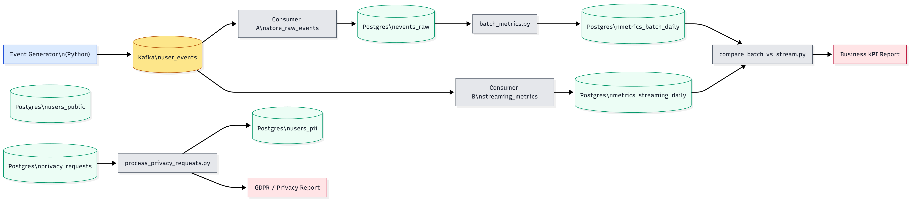

# GDPR-Compliant Real-Time Analytics Platform

**Author:** Devarsh Bende  
**Role:** Data Engineer  
**Certification:** AWS Certified Data Engineer – Associate  

A realistic, end-to-end data engineering project that simulates an EU e-commerce analytics platform:

- Real-time event ingestion and aggregation
- Batch ETL on raw events (Lambda-style: streaming + batch paths)
- GDPR-aware data model with strict PII separation
- Automated *right-to-be-forgotten* flow
- Business-facing daily KPI report
- Compliance-facing GDPR audit report

---

## 1. What this project shows

This project is meant to show how I think and work as a **Data Engineer**:

- I can design and operate **streaming and batch pipelines**
- I can work with **Kafka + Postgres** in a realistic, service-based setup
- I understand **GDPR**: PII separation, anonymization, and delete requests
- I don’t just create tables; I produce **useful outputs**:
  - Business KPIs: traffic, purchases, revenue, batch vs streaming consistency
  - GDPR metrics: number of requests, processing times, anonymized users
- I structure code and tests so the design maps cleanly to **AWS data services**

---

## 2. High-level architecture

**Scenario:** EU e-commerce / SaaS product tracking user events.

### 2.1 Architecture diagram



### 2.2 Main pieces

1. **Event generator (Python)**  
   `data_generators/generate_events.py`  
   - Produces synthetic events: `page_view`, `add_to_cart`, `purchase`  
   - Sends events to Kafka topic `user_events`.

2. **Streaming path**
   - `consumers/store_raw_events.py`  
     - Consumes `user_events`, writes all events into `events_raw` (Postgres).
   - `consumers/streaming_metrics.py`  
     - Consumes `user_events`, maintains `metrics_streaming_daily`  
       (daily events + revenue per event type).

3. **Batch path**
   - `batch/batch_metrics.py`  
     - Reads from `events_raw`, computes daily metrics into `metrics_batch_daily`.
   - `batch/compare_batch_vs_stream.py`  
     - Compares batch vs streaming metrics for a given day (events + revenue diffs).

4. **GDPR / privacy**
   - `users_pii` – only personal data: `email`, `full_name`, `address`.
   - `users_public` – non-PII attributes for analytics: `country`, `signup_date`.
   - `privacy_requests` – rows representing “delete my data” requests by email.
   - `gdpr/process_privacy_requests.py`  
     - Finds users by email in `users_pii`.  
     - Anonymizes PII (sets email, name, address to `NULL`).  
     - Marks requests as processed.

5. **Reports**
   - `reports/generate_daily_report.py`  
     - Business KPI report: total events, total revenue, batch vs streaming differences.
   - `reports/gdpr_audit_report.py`  
     - GDPR audit report: number of requests, processed vs pending, average processing time, anonymized users.

---

## 3. Data model & GDPR design

**Tables:**

- `users_pii`
  - `user_id` (UUID, PK)
  - `email`
  - `full_name`
  - `address`
  - `created_at`

- `users_public`
  - `user_id` (UUID, PK)
  - `country`
  - `signup_date`
  - `created_at`

- `events_raw`
  - `event_id` (UUID, PK)
  - `user_id` (UUID)
  - `event_type` (`page_view`, `add_to_cart`, `purchase`)
  - `event_timestamp`
  - `amount` (for purchases)
  - `metadata` (JSON)
  - `created_at`

- `metrics_streaming_daily`
  - `event_date`
  - `event_type`
  - `total_events`
  - `total_amount`

- `metrics_batch_daily`
  - same columns as `metrics_streaming_daily`, computed in batch

- `privacy_requests`
  - `id`
  - `email`
  - `requested_at`
  - `processed_at`

**Privacy behavior:**

- PII exists only in `users_pii`.  
- Analytics tables (`events_raw`, metrics tables) never store email/name; they use `user_id` and non-PII.  
- A new row in `privacy_requests` triggers anonymization:
  - Lookup by email in `users_pii`
  - Set email, full_name, address to `NULL`
  - Set `processed_at` timestamp  
- Aggregates remain usable for business; the user’s personal identity is removed.

---

## 4. Tech stack

**Language & libraries**

- Python 3.12  
- `kafka-python-ng` – Kafka client  
- `psycopg2-binary` – Postgres client  
- `Faker` – synthetic test data  
- `pytest` – tests  

**Infrastructure (local)**

- Kafka (Confluent images)  
- Zookeeper  
- Postgres 15  
- Docker & Docker Compose  

**Concepts**

- Streaming vs batch processing  
- Lambda-style architecture (two paths to the same metrics)  
- Data modeling under GDPR  
- Automated privacy workflows  
- Testable, modular ETL code  

---

## 5. Run it locally (Windows / PowerShell)

> Replace `C:\Users\yourname` with your actual path.

### 5.1 Start Docker services

```powershell
cd C:\Users\yourname\gdpr-realtime-analytics-platform

docker compose up -d
# or:
# docker-compose up -d

docker ps  # check kafka, zookeeper, postgres are running
5.2 Virtualenv & dependencies
python -m venv .venv
.\.venv\Scripts\Activate.ps1

pip install -r .\requirements.txt
pip install pytest

5.3 Seed users (safe to re-run)
python -m data_generators.generate_users

5.4 Start consumers & generator

Use three PowerShell terminals, all from the project root with venv activated.

Terminal 1 – raw events → events_raw

python -m consumers.store_raw_events


Terminal 2 – streaming metrics → metrics_streaming_daily

python -m consumers.streaming_metrics


Terminal 3 – event generator

python -m data_generators.generate_events


Let Terminal 3 run so data flows through the system.

5.5 Batch metrics & comparison

Terminal 4 – batch + compare

cd C:\Users\yourname\gdpr-realtime-analytics-platform
.\.venv\Scripts\Activate.ps1

# Batch metrics for today
python -m batch.batch_metrics

# Compare batch vs streaming for today
python -m batch.compare_batch_vs_stream

6. Reports
6.1 Daily business report
python -m reports.generate_daily_report
# or:
# python -m reports.generate_daily_report YYYY-MM-DD


Creates:

Console summary: total events, total revenue, batch vs streaming per event type.

Markdown file: reports/output/business_report_YYYY-MM-DD.md.

6.2 GDPR / privacy audit report
python -m reports.gdpr_audit_report


Shows:

Total privacy requests

Processed vs pending

Average processing time (if any)

Number of users with anonymized PII

7. Simulate a GDPR deletion

Open Postgres inside the container:

docker ps  # find postgres container name
docker exec -it gdpr-realtime-analytics-platform-postgres-1 psql -U de_user -d de_db


Get a real email:

SELECT email FROM users_pii WHERE email IS NOT NULL LIMIT 1;


Insert a privacy request:

INSERT INTO privacy_requests (email) VALUES ('copied_email_here');
\q


Run the GDPR processor (PowerShell, with venv):

python -m gdpr.process_privacy_requests


The user’s PII in users_pii is anonymized; aggregates remain intact.

8. Tests

Run tests:

pytest


Example: tests/test_gdpr.py inserts a fake user and privacy request, runs the GDPR processor, and asserts that PII fields in users_pii are NULL.


This version drops straight in as your new `README.md` and uses your `archdiagram.PNG` image for the architecture section. :contentReference[oaicite:0]{index=0}
::contentReference[oaicite:1]{index=1}